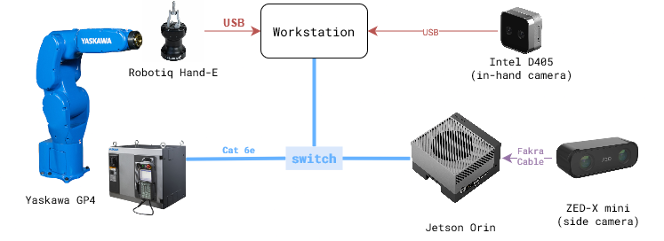

The robot controller, side camera, and in-hand camera (Intel D405) are interfaced over ROS. The `compose.yml` provides the websocket interface to ROS, and docker file for Intel-D405 camera and Yaskawa robot. Zed-X camera ROS node is launched on Jetson using [https://github.com/stereolabs/zed-ros-wrapper](https://github.com/stereolabs/zed-ros-wrapper).

